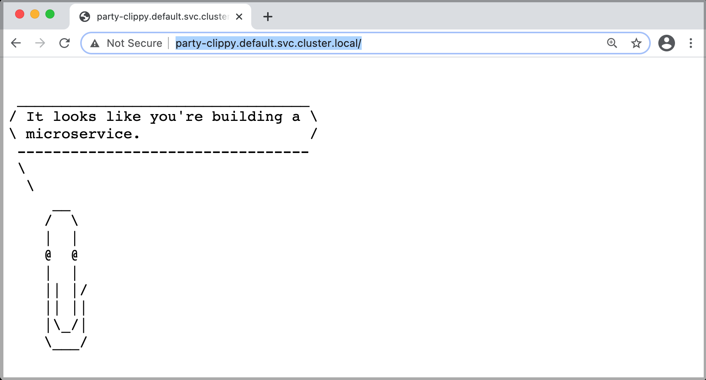

# kubectl-plugin-socks5-proxy

This is a kubectl plugin that creates a local SOCKS5 proxy through which you can access to Services or Pods in a Kubernetes cluster.

What the plugin actually does is that it create a SOCKS proxy server Pod in a Kubernetes cluster and forwards a local port (default:1080) to the proxy. So you can access to Servcies or Pods in Kuberenetes cluster by using the local port as SOCKS5 proxy like this:

```bash
curl --socks5-hostname localhost:1080 http://httpbin.default.svc.cluster.local/headers
```

## Installation

This is a way to install the plugin through [krew](https://krew.sigs.k8s.io/). After installing krew by following [this](https://krew.sigs.k8s.io/docs/user-guide/setup/install/), you can install the plugin like this:

```
kubectl krew install socks5-proxy
```

You can search the plugin with a keyword like this:
```
kubectl krew search socks5

NAME          DESCRIPTION                                      INSTALLED
socks5-proxy  SOCKS5 proxy to Services or Pods in the cluster  no
```

After installed the plugin, you can run the plugin like this:
```
kubectl socks5-proxy
```

## How to use

### Usage

```TXT
Usage: 
  kubectl socks5-proxy

Options:
  -n, --namespace <namespace>   Namespace to create SOCKS5 proxy server in
                                Default: default

  -p, --port <local port>       Local port to be forwarded to the SOCKS5 proxy server (Pod).
                                A client connects to this port, then the connection is forwarded to the 
                                SOCKS5 proxy server, which is then forwareded to the destination server
                                Default: 1080

  -i, --image <socks5 image>    Set the image used as socks5 proxy server
                                Default: serjs/go-socks5-proxy

  --skip-cleanup-proxy          Skip cearning up SOCKS5 proxy pod
                                Default: Cleaning up SOCKS5 proxy pod at the end

  -h, --help                    Show this message
```

### Deploy an sample app and Create SOCKS5 proxy

Suppose you deploy a sample app in a Kubernetes cluster like this
```bash
git clone https://github.com/yokawasa/kubectl-plugin-socks5-proxy.git
cd kubectl-plugin-socks5-proxy
kubectl apply -f sample-apps/party-clippy.yaml

kubectl get svc

NAME           TYPE        CLUSTER-IP     EXTERNAL-IP   PORT(S)   AGE
kubernetes     ClusterIP   10.0.0.1       <none>        443/TCP   96d
party-clippy   ClusterIP   10.0.5.226     <none>        80/TCP    1m
```

First of all, create a local SOCKS5 proxy (default: 1080 port) by running `kubectl socks5-proxy` like this:
```
kubectl socks5-proxy

using: namespace=default
using: port=1080
Creating Socks5 Proxy (Pod)...
pod/socks5 created
Forwarding from 127.0.0.1:1080 -> 1080
Forwarding from [::1]:1080 -> 1080
```

### Use SOCKS5 Proxy in Curl

Now you can access Srvices or Pods in the Kubernetes cluster from a local machine by using the local port as SOCKS proxy in Curl
```
# Service name
curl --socks5-hostname localhost:1080 party-clippy
# Service name
curl --socks5-hostname localhost:1080 http://party-clippy
# FQDN
curl --socks5-hostname localhost:1080 http://party-clippy.default.svc.cluster.local
```

```
  _________________________________
/ It looks like you're building a \
\ microservice.                   /
 ---------------------------------
 \
  \
     __
    /  \
    |  |
    @  @
    |  |
    || |  /
    || ||
    |\_/|
    \___/
```

### Use SOCKS5 Proxy in Google Chrome browser

First, let's configuring your Chrome browser to use SOCKS5 proxy like this:

**Linux**
```
/usr/bin/google-chrome \
    --user-data-dir="$HOME/proxy-profile" \
    --proxy-server="socks5://localhost:1080"
```
**macOS**
```
"/Applications/Google Chrome.app/Contents/MacOS/Google Chrome" \
    --user-data-dir="$HOME/proxy-profile" \
    --proxy-server="socks5://localhost:1080"
```
**Windows**
```
"C:\Program Files (x86)\Google\Chrome\Application\chrome.exe" ^
    --user-data-dir="%USERPROFILE%\proxy-profile" ^
    --proxy-server="socks5://localhost:1080"
```
See also [How to Set up SSH SOCKS Tunnel for Private Browsing](https://linuxize.com/post/how-to-setup-ssh-socks-tunnel-for-private-browsing/)

> NOTE:
The --proxy-server="socks5://yourproxy:1080" flag tells Chrome to send all http:// and https:// URL requests through the SOCKS proxy server "yourproxy:1080", using version 5 of the SOCKS protocol. The hostname for these URLs will be resolved by the proxy server, and not locally by Chrome.
> ref: [Configuring a SOCKS proxy server in Chrome](https://www.chromium.org/developers/design-documents/network-stack/socks-proxy)

Now you are ready to access Services or Pods in the Kubernetes cluster with your Chrome browser




## Contributing

Bug reports and pull requests are welcome on GitHub at https://github.com/yokawasa/kubectl-plugin-socks5-proxy
